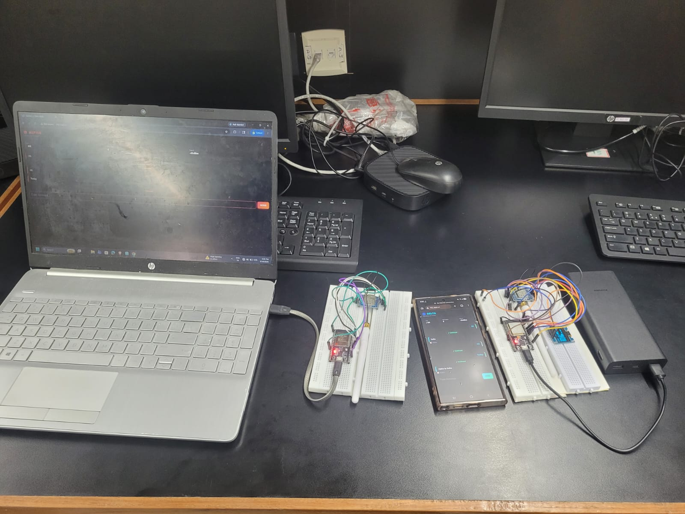
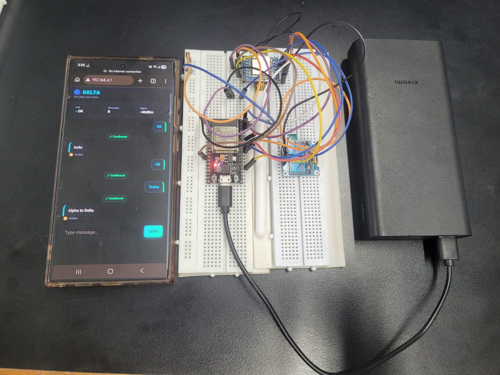
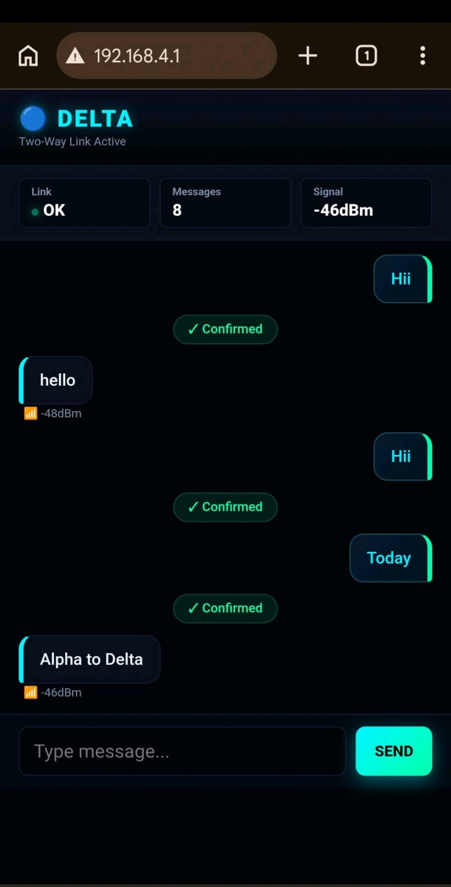

# 📡 Long-Range Wireless Communication System using ESP32 & LoRa


A real-time bidirectional long-range wireless communication system built using **ESP32** and **SX1278 LoRa (433 MHz)** modules. The project enables offline communication between two embedded nodes through a lightweight web interface and OLED display.

---

## 📖 Project Overview

This project was developed as part of the **Embedded Design Laboratory**. It demonstrates how LoRa technology can be used to establish reliable long-range wireless communication between two ESP32 devices without requiring internet connectivity.

The system supports real-time message exchange, acknowledgement (ACK) handling, RSSI monitoring, OLED feedback, and a web-based messaging interface.

---
## 📑 Contents

- [Project Overview](#-project-overview)
- [Key Features](#-key-features)
- [Hardware Components](#-hardware-components)
- [Hardware Setup](#-hardware-setup)
- [Circuit Diagram](#-circuit-diagram)
- [Web Interface](#-web-interface)
- [Repository Structure](#-repository-structure)
- [Applications](#-applications)
- [Documentation](#-documentation)
- [Future Improvements](#-future-improvements)
- [Contributors](#-contributors)

---
## ✨ Key Features

- 📡 Bidirectional LoRa communication
- ✅ ACK-based reliable message delivery
- 📶 Live RSSI monitoring
- 📟 OLED display for device status
- 🌐 Lightweight web interface
- 🔄 Automatic message synchronization
- 🔋 Low-power embedded implementation
- 📴 Fully offline operation

---

## 🛠 Hardware Components

| Component | Description |
|-----------|-------------|
| ESP32 Dev Board | Main Controller |
| SX1278 LoRa Module | 433 MHz Wireless Communication |
| OLED Display | Real-time Status Display |
| Breadboard & Jumper Wires | Prototyping |
| Wi-Fi Access Point | Local Web Interface |

---

## 🖼 Hardware Setup



---

## 🔌 Circuit Diagram



---

## 🌐 Web Interface



---

## 📂 Repository Structure

```text
Long-Range-Wireless-Communication-ESP32-LoRa
│
├── docs/
├── firmware/
│   ├── Alpha_Node/
│   └── Delta_Node/
├── report/
└── README.md
```

---

## 🚀 Applications

- Emergency Communication
- Disaster Recovery Networks
- Remote Monitoring
- Rural Connectivity
- Industrial IoT
- Smart Agriculture

---

## 📚 Documentation

The complete project report is available in the **report/** folder.

---

## 👨‍💻 Developed By

**Dhruvi Rakeshkumar Singh**

Pandit Deendayal Energy University (PDEU)
Electronics & Communication Engineering

---
## 🚀 Future Improvements

- End-to-end AES encryption
- Multi-node LoRa mesh networking
- GPS integration
- Battery-powered portable deployment
- Mobile application support
- LoRaWAN cloud connectivity

---

## 👥 Contributors

- **Dhruvi Rakeshkumar Singh**
- **Preet D. Desai**

Developed as part of the **Embedded Design Laboratory** at **Pandit Deendayal Energy University (PDEU)**.
